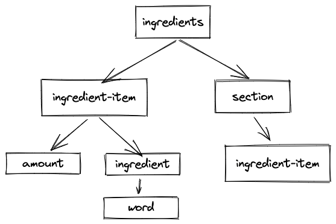

# recipe parser

> See [change history](./CHANGES.md)

In its current incarnation, lexes, parses, and converts, lists of ingredients and steps into a JSON object (see below) used by the [recipe-ui](https://github.com/robphilipp/recipes-ui) project. The goal of the project is to parse entire recipes.

> This is work in progress.

A shout-out to the awesome libraries the recipe parser relies on

1. [Chevrotain](https://chevrotain.io/docs/) for lexing, parsing, and semantics.
2. [pluralize](https://github.com/plurals/pluralize) for pluralization.
3. [XRegExp](https://github.com/slevithan/xregexp) for sanity using regular expressions.

The following code will parse a list of ingredients into a JSON object

```typescript
const text = `dough
        1 1/2 cp all-purpose flour
        1 tsp vanilla extract,
        sauce
        1 cup milk
        1 egg`
const {recipe, errors} = toRecipe(text, {inputType: ParseType.INGREDIENTS})
```

...and the result...

```json
{
  "type": "ingredients",
  "ingredients": [
    {
      "amount": {
        "quantity": 1.5,
        "unit": "cup"
      },
      "ingredient": "all-purpose flour",
      "section": "dough"
    },
    {
      "amount": {
        "quantity": 1,
        "unit": "tsp"
      },
      "ingredient": "vanilla extract",
      "section": "dough"
    },
    {
      "amount": {
        "quantity": 1,
        "unit": "cup"
      },
      "ingredient": "milk",
      "section": "sauce"
    },
    {
      "amount": {
        "quantity": 1,
        "unit": "piece"
      },
      "ingredient": "egg",
      "section": "sauce"
    }
  ]
}
```

As a more complete example, we parse the text for a fake Piri-Piri chicken recipe.

```typescript
    it("should be able to parse the piri piri chicken recipe", () => {
    const input = `Ingredients
        Powder
            1. 2 tbsp sugar
            2) 1 tbsp paprika
            1 tbsp coriander
            1 tbsp cumin
            1 1/2 tbsp salt
            2 tbsps new mexico chile powder
            Sauce
            3 cloves garlic
            8 fresno peppers
            1/3 cup lemon juice
            1/4 cup red wine vinegar
            Chicken
            1 whole chicken
            Steps
            Sauce
            1. first step
            2. second step
            Chicken
            3) third step
            `
    const {recipe, errors} = toRecipe(input, {deDupSections: true})
    expect(recipe).toEqual({
        type: "recipe",
        ingredients: [
            {amount: {quantity: 2, unit: UnitType.TABLESPOON}, ingredient: 'sugar', section: 'Powder', brand: null},
            {amount: {quantity: 1, unit: UnitType.TABLESPOON}, ingredient: 'paprika', section: null, brand: null},
            {amount: {quantity: 1, unit: UnitType.TABLESPOON}, ingredient: 'coriander', section: null, brand: null},
            {amount: {quantity: 1, unit: UnitType.TABLESPOON}, ingredient: 'cumin', section: null, brand: null},
            {amount: {quantity: 1.5, unit: UnitType.TABLESPOON}, ingredient: 'salt', section: null, brand: null},
            {amount: {quantity: 2, unit: UnitType.TABLESPOON}, ingredient: 'new mexico chile powder', section: null, brand: null},

            {amount: {quantity: 3, unit: UnitType.PIECE}, ingredient: 'cloves garlic', section: 'Sauce', brand: null},
            {amount: {quantity: 8, unit: UnitType.PIECE}, ingredient: 'fresno peppers', section: null, brand: null},
            {amount: {quantity: 0.3333333333333333, unit: UnitType.CUP}, ingredient: 'lemon juice', section: null, brand: null},
            {amount: {quantity: 0.25, unit: UnitType.CUP}, ingredient: 'red wine vinegar', section: null, brand: null},

            {amount: {quantity: 1, unit: UnitType.PIECE}, ingredient: 'whole chicken', section: 'Chicken', brand: null},
        ],
        steps: [
            {id: "1.", step: "first step", title: "Sauce"},
            {id: "2.", step: "second step", title: null},
            {id: "3)", step: "third step", title: "Chicken"},
        ]
    })
    expect(errors).toHaveLength(0)
})

```

## usage

To use the recipe parser, add the library to your project

```shell
npm install @saucie/recipe-parser
```

and install the peer dependencies

```shell
npm install chevrotain
npm install pluralize
npm install xregexp
```

Version compatibility

| package  | support versions | notes |
| --------|-----------------:| -------|
| chevrotain |       \>= 10.0.0 | 9.0.0 works but the changes the CST nodes to be possibly undefined (typescript) |
| pluralize |        \>= 7.0.0 | Possibly works with lower versions (let me know) |
| xregexp |        \>= 4.0.0 | Possibly works with lower versions (let me know) |

Add an import to your module

```typescript
import {toRecipe} from "@saucie/recipe-parser";
```

And then call the `toRecipe(...)` function with any options

```typescript
import {toRecipe, ParseType} from "@saucie/recipe-parser";

const myRecipe = "some recipe text"
const {recipe, errors} = toRecipe(myRecipe, {deDupSections: true, inputType: ParseType.RECIPE})
```

If there are no errors, the recipe will be a JSON object of type `Recipe`

```typescript
export type Recipe = {
    type: string
    ingredients: Array<Ingredient>
    steps: Array<Step>
}

// which depends on the following definitions
export type Ingredient = {
    amount: Amount
    ingredient: string
    section: string | null
    brand: string | null
}

export type Step = {
    id: string
    title: string | null
    step: string
}

export type Amount = {
    quantity: number
    unit: Unit
}

enum Unit {
    MILLIGRAM = 'mg', GRAM = 'g', KILOGRAM = 'kg',
    OUNCE = 'oz', POUND = 'lb',
    MILLILITER = 'ml', LITER = 'l', TEASPOON = 'tsp', TABLESPOON = 'tbsp', FLUID_OUNCE = 'fl oz',
    CUP = 'cup', PINT = 'pt', QUART = 'qt', GALLON = 'gal',
    PIECE = 'piece', PINCH = 'pinch'
}
```


```typescript
/**
 * Converts the text to a list of recipe ingredients with optional sections. This is the
 * function to call to convert a test recipe into a recipe object.
 * @param text The text to convert into a recipe object
 * @param [options = defaultOptions] The options used for parsing the text into a
 * recipe or recipe fragment.
 * @return A recipe result holding the recipe object and any parsing errors
 */
function toRecipe(text: string, options: Options = defaultOptions): RecipeResult {/*...*/}
```

and the options are 

```typescript
export type Options = {
    // When set to `true` only sets the section of the first ingredient of each
    // section to current section.
    deDupSections?: boolean
    // When set to `true` then logs warning to the console, otherwise
    // does not log warnings. Warning and errors are reported in the returned object
    // in either case.
    logWarnings?: boolean
    // The thing that the input text represents: a whole recipe, a list of ingredients,
    // or a list of steps.
    inputType?: ParseType
}
```

and the parse-type is defined as

```typescript
export enum ParseType {
    RECIPE,
    INGREDIENTS,
    STEPS
}
```

and the recipe result is defined as 

```typescript
/**
 * The result of the lexing, parsing, and visiting.
 */
export type RecipeResult = {
    recipe: Recipe,
    errors: Array<ILexingError>
}
```

## the grammar

In order for a recipe's ingredients to be parsed, then must adhere to the following grammar, which uses the
[Augmented Backus-Naur Form (ABNF)](https://en.wikipedia.org/wiki/Augmented_Backus–Naur_form)
notation ([see this nice article](https://matt.might.net/articles/grammars-bnf-ebnf/)) for an introduction to grammar
notations.

```
// an ingredient list has either sections or ingredient itmes or both
ingredients = *[section] *[ingredient_item]

// a section has a header and a list of ingredient items
section = section_header 1*ingredient_item

// a section header must be on its own line, or surrounded by "#" or some
// combination of thos
section_header = (newline / "#") 1*word (*["#"] / newline)

// an ingredient item has an optional list ID, an amount, and an ingredient
ingredient_item = [ingredient_item_id 1*whitespace] amount ingredient

// an ingredient item ID is a list item, for example "1.", "*", "-", "•", "1)", etc
ingredient_item_id = ( [ "(" ] number [ "." / ")" / ":" ] ) / ( [ "-" / "*" / "•" ])

// the amount is a quantity and an optional unit (when no unit is present, will be
// treated as pieces, such as "1 egg" would become "1 piece egg")
amount = quantity [white_space] [unit]

// the ingredient (e.g. egg, all-purpose flour, etc) is a sequence of words that
// ends in a newline
ingredient = *word newline

// the quantity is a number or a fraction. A fraction can be expressed as a whole
// number and a fractional part (e.g. 1 1/4) or as a whole number and a unicode
// fraction
quantity = number / fraction

// units can be abbreviated, can be synonyms, plural...see the "unitMatcher(..)" function
// in the RecipeLexer.ts file for more details
unit = (mg / g / kg / oz / lb / ml / l / tsp / tbsp/ fl oz / cup / pt / qt / gallon /)["."]

// a word
word = 1*("\w" / "." / "'" / "(" / ")" / "[" / "]" / "{" / "}" / "-")

number = integer / decimal / (integer unicode_fraction)
integer = 0 / (natural_digit *digit)
decimal = integer "." 1*digit
fraction = integer "/" natural_digit *digit
natural_digit = 1 / 2 / 3 / 4 / 5 / 6 / 7 / 8 / 9
digit = 0 / natural_digit
unicode_fraction = \u00BC | \u00BD | \u00BE | ...

newline = "\n" / "\r\n"
white_space = *( " " / "\t" )
```

Recipes using this grammar get parsed into the following syntax tree structure.



